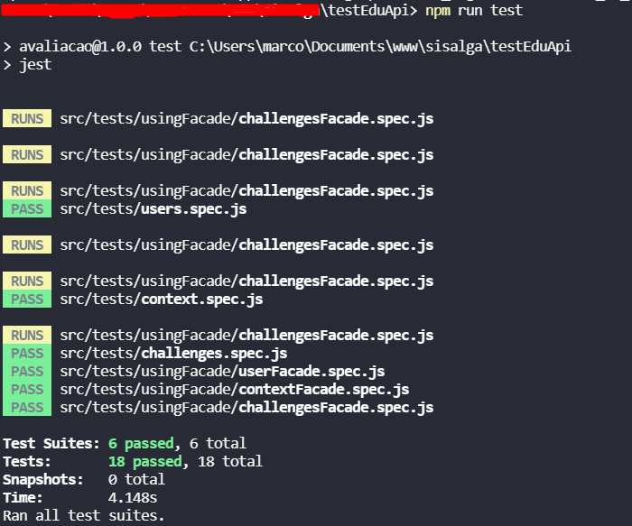

# Testes de unidade e integração do serviço EducAPI

Projeto feito para avaliar o serviço da apoio a alfabetização EducAPI.

A aplicação pode ser acessada em [EducAPI](https://api.apps4society.dcx.ufpb.br/educapi/) 
A documentação pode ser acessada en [Documentação](https://api.apps4society.dcx.ufpb.br/educapi/swagger-ui.html). 


## Pré requisitos
É necessário ter o [NodeJS](https://nodejs.org) instalado na sua máquina
Assim como o [JestJS](https://jestjs.io/)

## Executando os testes
Execute no terminal os comandos abaixo
```sh
$ git clone https://github.com/MarcosLudgerio/testEduApi.git
$ cd testEducApi
$ npm install
$ npm run test
```
Após a execução, os testes irão executar e um feedback irá ser exibido na tela


## Tecnologias Usadas
- JavaScript 
- ECMA Script 6
- NodeJS 12
- Jest 27.2
